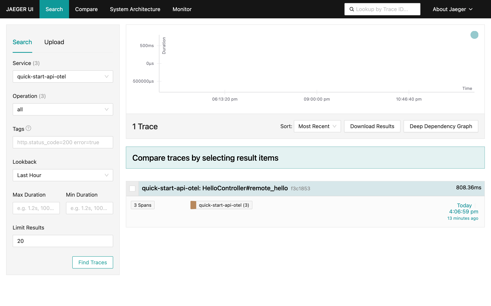
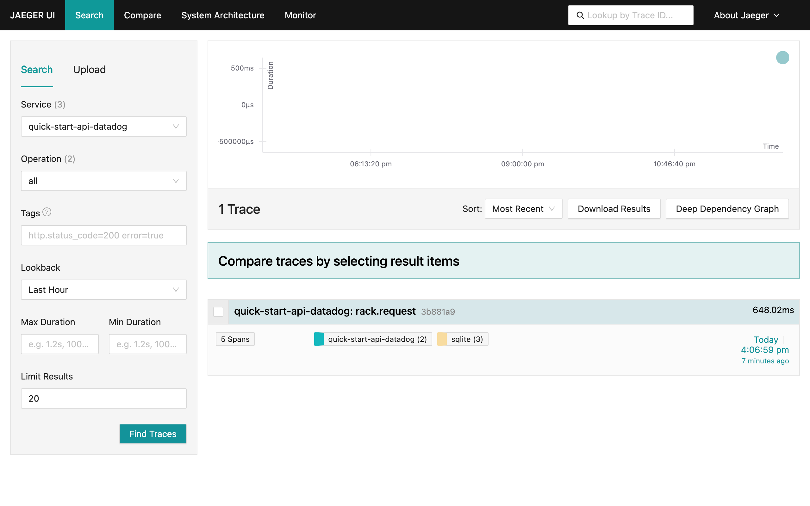
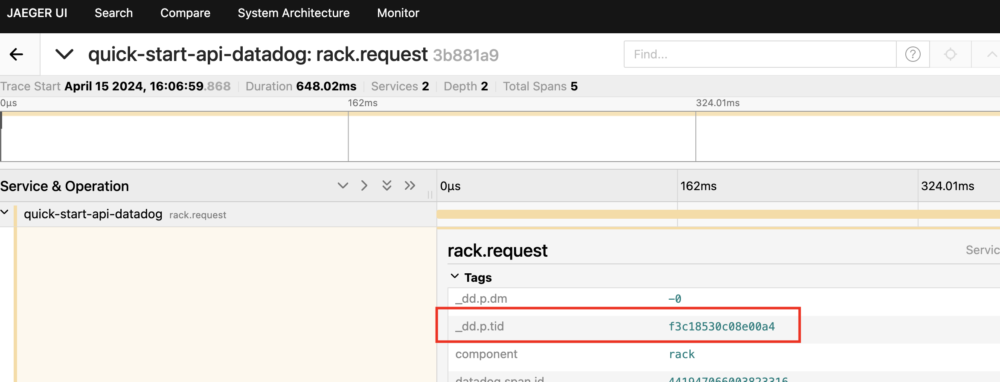
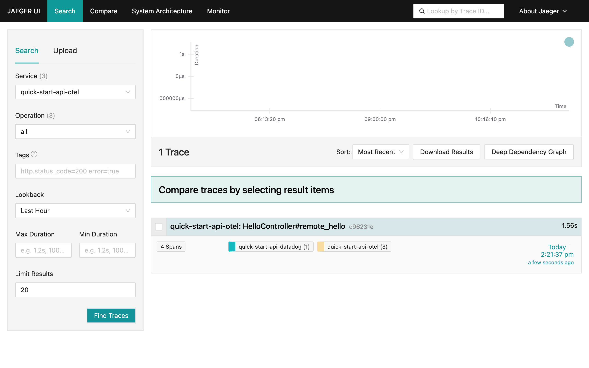

Have you ever faced challenges with telemetry data standardization from the
Datadog SDKs? The integration of Datadog SDKs with OpenTelemetry SDKs can
complicate observability systems due to inconsistent telemetry data sent to
Datadog. This inconsistency can make detailed data analysis, such as traces,
inaccessible before it's sent to Datadog, thereby complicating the setup of an
efficient observability pipeline.

This article will show how this problem starts in an observability stack and how
we can handle it with the OpenTelemetry Collector. We will also show how to set
up an observability pipeline that accepts Datadog-instrumented apps and allows
us to receive and correlate data in OpenTelemetry stacks without sending
telemetry data for Datadog.

## The Legacy SDK issue

Datadog is a monitoring and analytics platform that allows developers and IT
operators to observe the performance of their applications, servers, databases,
and tools, all in one place, being one of the major players in the observability
landscape.

To allow developers to integrate with their platform quickly, they provide a set
of SDKs that enable applications to send telemetry automatically to Datadog.
These SDKs are used for apps that were instrumented before OpenTelemetry started
to standardize how to send telemetry with the OTLP protocol. Due to that,
systems that use both Datadog SDKs and OTel SDKs can be complex in terms of
observability where their data is only available for analysis at the server
level. In this scenario, developers cannot use other OTel solutions, like
traces, to analyze data before sending it to Datadog.

## Structuring an Observability Stack with Datadog

When we instrument an API with Datadog SDKs, we need to send the telemetry data
to an agent, and then this agent sends your telemetry to Datadog servers.

```mermaid
graph LR
  APIDD["API (with Datadog SDK)"]
  DDAgent["Datadog Agent"]
  DDService["Datadog Service"]
  APIDD -- send data in datadog format --> DDAgent
  DDAgent -- forward data --> DDService
```

However, with the rise of OpenTelemetry as standard, new APIs usually centralize
the telemetry into an OpenTelemetry Collector and then send data to Datadog,
creating mixed environments, where all data is only processed and correlated on
Datadog servers.

```mermaid
graph LR
  APIOTel["API (with OTel SDK)"]
  OTelCol["OTel Collector"]
  APIDD["API (with Datadog SDK)"]
  DDAgent["Datadog Agent"]
  DDService["Datadog Service"]
  APIOTel -- send data with OTLP --> OTelCol
  APIDD -- send data in datadog format --> DDAgent
  OTelCol -- forward data --> DDService
  DDAgent -- forward data --> DDService
  APIOTel <-- communication --> APIDD
```

To simplify this structure, we can centralize all the communication in an
OpenTelemetry Collector and set up a `[datadog`
receiver](https://github.com/open-telemetry/opentelemetry-collector-contrib/tree/main/receiver/datadogreceiver)
that works like an agent, receiving traces and metrics in Datadog proprietary
format:

```mermaid
graph LR
  APIOTel["API (with OTel SDK)"]
  OTelCol["OTel Collector"]
  APIDD["API (with Datadog SDK)"]
  DDService["Datadog Service"]
  APIOTel -- send data with OTLP --> OTelCol
  APIDD -- send data in datadog format --> OTelCol
  OTelCol -- forward data --> DDService
  APIOTel <-- communication --> APIDD
```

To set up our OpenTelemetry Collector with this receiver, we need to use the
[OTel Collector Contrib](https://github.com/open-telemetry/opentelemetry-collector-contrib)
version and add
[the `datadog` receiver](https://github.com/open-telemetry/opentelemetry-collector-contrib/blob/main/receiver/datadogreceiver/README.md)
in the configuration file:

```yaml
receivers:
  otlp:
    protocols:
      grpc:
      http:

  datadog:
    endpoint: 0.0.0.0:8126
    read_timeout: 60s

  # ...

  service:
  pipelines:
    traces:
      receivers: [otlp, datadog]
      # ...
```

## Sending Datadog Data to Jaeger

Using the latest proposed architecture as a head start, let’s download a demo
example, showing how we can adapt this architecture to send data to Jaeger,
allowing developers to run the API locally and make any observability changes
needed before publishing to production.

First, open a terminal and download the demo with the following commands:

```bash
git clone git@github.com:kubeshop/tracetest.git
cd ./examples/datadog-propagation

docker compose -f ./docker-compose.step1.yaml up -d
```

This will start two Ruby on Rails APIs, one instrumented with
[ddtrace](https://github.com/datadog/dd-trace-rb) and another with
[OpenTelemetry SDK](https://github.com/open-telemetry/opentelemetry-ruby), both
connecting to an OpenTelemetry Collector that sends data to Jaeger:

```mermaid
graph LR
  APIOTel["API (with OTel SDK)"]
  OTelCol["OTel Collector"]
  APIDD["API (with Datadog SDK)"]
  Jaeger["Jaeger"]
  APIOTel -- send data with OTLP --> OTelCol
  APIDD -- send data in datadog format --> OTelCol
  OTelCol -- forward data --> Jaeger
  APIOTel <-- communication --> APIDD
```

Then, we will call the OTelSDK-instrumented API, which will execute an internal
endpoint on the Datadog-instrumented API and return an output. It is expected
that this operation will generate just one trace. You can try it by executing
the command:

```bash
> curl http://localhost:8080/remotehello
# it returns:
# {"hello":"world!","from":"quick-start-api-otel","to":"quick-start-api-datadog"}
```

However, when accessing Jaeger locally (via the link
[http://localhost:16686/](http://localhost:16686/)), you will see that **two**
disjointed traces were generated, one for each API:





In response, we will need to change our stack a little bit and apply some
changes. How can we solve this?

### Understanding TraceID Representations for Datadog and OpenTelemetry

This issue happens due to a difference in the representation of TraceIDs in
Datadog format and OTel SDK format. Datadog considers a TraceID as an unsigned
Int64, while the OpenTelemetry SDK considers it as a 128-bit hexadecimal
representation:

- **Datadog TraceID (int64):** `4289707906147384633`
- **Datadog TraceID (hex):** `3b881a9ce0197d39`
- **OTelSDK TraceID (hex):** `f3c18530c08e00a43b881a9ce0197d39`

Since we have two TraceID representations, we have two Traces in Jaeger.

To propagate their traces through an OpenTelemetry stack, Datadog has an
internal representation that can be used to reconstruct a TraceID, which they
call, internally in their SDK, as `Upper TraceID`, represented by the attribute
`_dd.p.tid` appended onto the first span of its trace:



Concatenating this `Upper TraceID` with Datadog’s TraceID in hexadecimal
representation (that we will call `Lower TraceID` ), we have the exact TraceID
representation for an OpenTelemetry stack:

```mermaid
%%{init: {"flowchart": {"htmlLabels": false}} }%%
graph TD
UpperTraceID["`**_dd.p.tid (hex)** f3c18530c08e00a4`"]
LowerTraceID["`**dd trace id (hex)** 3b881a9ce0197d39`"]
TraceID["`**OTel Trace ID** f3c18530c08e00a43b881a9ce0197d39`"]

UpperTraceID --> TraceID
LowerTraceID --> TraceID
```

Now, to create this representation, we will reconstruct the TraceID at the
OpenTelemetry Collector level, using the `[transform
processor](https://github.com/open-telemetry/opentelemetry-collector-contrib/tree/main/processor/transformprocessor)`.

### Reconstructing TraceID for Datadog Spans

The OTel Collector `[transform
processor](https://github.com/open-telemetry/opentelemetry-collector-contrib/tree/main/processor/transformprocessor)`
is a component that allows for the transformation of span data as it passes
through the OpenTelemetry Collector. It can modify attributes of a span such as
name, kind, attributes, resources, and instrumentation library, among others.

**In this context, it is used to reconstruct the TraceID for Datadog spans to
facilitate a unified tracing environment.**

We will declare it in the `processors` section in the OTel Collector Config with
the OTel Collector transform processor.

```yaml
processors:
  # ...

  transform:
    trace_statements:
      - context: span
        statements:
          # transformation statements
          - set(cache["upper_trace_id"], attributes["_dd.p.tid"]) where
            attributes["_dd.p.tid"] != nil
          - set(cache["lower_trace_id"], Substring(trace_id.string, 16, 16))
            where cache["upper_trace_id"] != nil
          - set(cache["combined_trace_id"], Concat([cache["upper_trace_id"],
            cache["lower_trace_id"]],"")) where cache["upper_trace_id"] != nil
          - set(trace_id.string, cache["combined_trace_id"]) where
            cache["combined_trace_id"] != nil
```

And then we will add four transformation statements:

- `set(cache["upper_trace_id"], attributes["_dd.p.tid"]) where attributes["_dd.p.tid"] != nil`,
  where we will capture the Upper TraceID from the `_dd.p.tid` attribute if it
  is defined and set it to a temporary cache;
- `set(cache["lower_trace_id"], Substring(trace_id.string, 16, 16)) where cache["upper_trace_id"] != nil`,
  where we will convert a Datadog TraceID into hexadecimal format (where we will
  have sixteen zeros plus the Lower TraceID). We will remove the "zeros” segment
  and grab the second half of it (this is why we have a sub string getting only
  the last 16 hex digits from the TraceID);
- `set(cache["combined_trace_id"], Concat([cache["upper_trace_id"], cache["lower_trace_id"]],"")) where cache["upper_trace_id"] != nil`,
  where we concatenate `upper_trace_id` and `lower_trace_id` into the
  OpenTelemetry TraceID;
- `set(trace_id.string, cache["combined_trace_id"]) where cache["combined_trace_id"] != nil`
  and finally we set the `trace_id` for this span with the string concatenation.

To see it working, let’s run our example again, with a different
`docker compose` file and then execute the same API call as before:

```bash
> docker compose -f ./docker-compose.step2.yaml up -d

> curl http://localhost:8080/remotehello
# it returns:
# {"hello":"world!","from":"quick-start-api-otel","to":"quick-start-api-datadog"}
```

When we enter into the Jaeger UI we see that our problem was partially solved.
Now, we have a trace propagated between the Datadog-instrumented API and the
OpenTelemetry-instrumented API, however, all child spans generated by Datadog
are segregated in a different trace, defined only as the Lower TraceID. This
happens because `ddtrace` only sends a `_dd.p.tid` attribute for the first span
generated internally, which makes our transform statements skip the child spans.




### Patching Datadog Trace to Send the Upper TraceID to Every Child Span

Since the OpenTelemetry Collector was
[designed to process spans considering distributed systems](https://opentelemetry.io/docs/collector/scaling/),
we don't have a way to maintain an internal state to replicate the `_dd.p.tid`
attribute for the child spans received by the `datadog` receiver.

We will solve this problem directly on the Datadog-instrumented API, applying a
minor patch to `ddtrace` to replicate `_dd.p.tid` to all child spans. In the
`ddtrace` Ruby version, we were able to do that by changing the trace
serialization to send this data as shown
[here](https://github.com/kubeshop/tracetest/blob/main/examples/datadog-propagation/quick_start_api_datadog/config/initializers/datadog.rb#L20):

```ruby
module Datadog
  module Tracing
    module Transport
      class SerializableTrace
        def to_msgpack(packer = nil)
          if ENV.has_key?('INJECT_UPPER_TRACE_ID')
            return trace.spans.map { |s| SerializableSpan.new(s) }.to_msgpack(packer)
          end

          upper_trace_id = trace.spans.find { |span| span.meta.has_key?('_dd.p.tid') }.meta['_dd.p.tid']
          trace.spans.each do |span|
            span.meta["propagation.upper_trace_id"] = upper_trace_id
          end

          trace.spans.map { |s| SerializableSpan.new(s) }.to_msgpack(packer)
        end
      end
    end
  end
end
```

Since it is a customization on the traces, we opted to grab the `_dd.p.tid`
attribute and inject it in each span as the `propagation.upper_trace_id`
attribute. We
[changed](https://github.com/kubeshop/tracetest/blob/main/examples/datadog-propagation/collector/collector.config.step3.yaml#L18)
the `transform` processor in the OpenTelemetry Collector to consider this:

```yaml
transform:
  trace_statements:
    - context: span
      statements:
        - set(cache["upper_trace_id"], attributes["propagation.upper_trace_id"])
          where attributes["propagation.upper_trace_id"] != nil
        - set(cache["lower_trace_id"], Substring(trace_id.string, 16, 16)) where
          cache["upper_trace_id"] != nil
        - set(cache["combined_trace_id"], Concat([cache["upper_trace_id"],
          cache["lower_trace_id"]],"")) where cache["upper_trace_id"] != nil
        - set(trace_id.string, cache["combined_trace_id"]) where
          cache["combined_trace_id"] != nil
```

With these changes done, let’s run a new setup with our example:

```bash
> docker compose -f ./docker-compose.step3.yaml up -d

> > curl http://localhost:8080/remotehello
# it returns:
# {"hello":"world!","from":"quick-start-api-otel","to":"quick-start-api-datadog"}
```

Opening the Jaeger UI again we see that our problem was solved! Now we have a
single trace between both APIs and can evaluate a process as a whole in a
developer machine.


## Final Remarks

We have discussed integrating Datadog-instrumented apps in an OpenTelemetry
stack, seeing the problem of different TraceID representations for Datadog and
OpenTelemetry, which can lead to disjointed traces. To solve that we are using
an OpenTelemetry Collector with a transform processor to reconstruct the TraceID
for Datadog spans, facilitating a unified tracing environment.

As a team focused on building an open source tool in the observability space,
the opportunity to help the overall OpenTelemetry community was important to us.
That’s why we were researching and finding new ways of collecting traces from
different tools and frameworks and making them work with the OpenTelemetry
ecosystem.

The [example sources](https://github.com/kubeshop/tracetest/tree/main/examples/datadog-propagation) used
in this article,
and [setup instructions](https://github.com/kubeshop/tracetest/blob/main/examples/datadog-propagation/README.md) are
available in the Tracetest GitHub repository.
